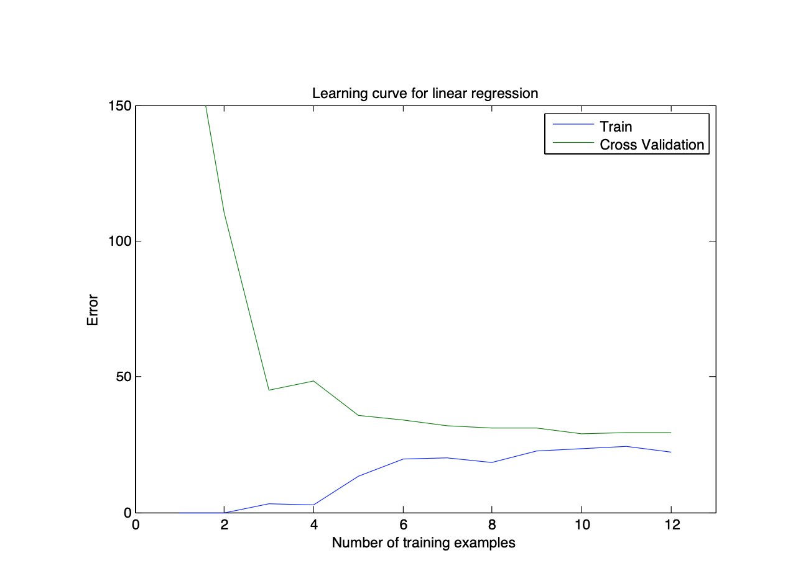

# Intro_To_ML

## This repository comprise teaching slides and homeworks.

### Week 1, Linear Regression
In this part of this exercise, you will implement linear regression with one variable to predict profits for a food truck. Suppose you are the CEO of a restaurant franchise and are considering different cities for opening a new outlet. The chain already has trucks in various cities and you have data for profits and populations from the cities. You would like to use this data to help you select which city to expand to next.
The file ex1data1.txt contains the dataset for our linear regression prob- lem. The first column is the population of a city and the second column is the profit of a food truck in that city. A negative value for profit indicates a loss.

**When you make a model and your computer is learned to predict profit for a given population, you will be able to draw a plot as follows:** 

## Week 3 

### Regularized Linear Regression

In the first half of the exercise, you will implement regularized linear regres- sion to predict the amount of water flowing out of a dam using the change of water level in a reservoir. In the next half, you will go through some diag- nostics of debugging learning algorithms and examine the effects of bias v.s. variance.

#### Bias-variance

An important concept in machine learning is the bias-variance tradeoff. Mod- els with high bias are not complex enough for the data and tend to underfit, while models with high variance overfit to the training data. In this part of the exercise, you will plot training and test errors on a learning curve to diagnose bias-variance problems.

You will now implement code to generate the learning curves that will be useful in debugging learning algorithms. Recall that a learning curve plots training and cross validation error as a function of training set size.

#### Support Vector Machines

In this exercise, you will be using support vector machines (SVMs) with various example 2D datasets. Experimenting with these datasets will help you gain an intuition of how SVMs work and how to use a Gaussian kernel with SVMs.

